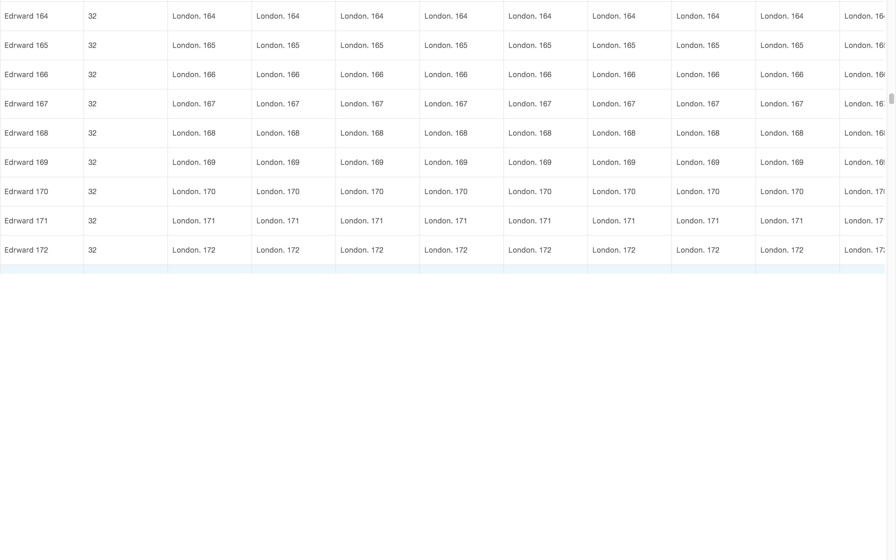

Version

antd@2.13.3

Environment

macOS Sierra 10.12.6, 61.0.3163.100（正式版本）64bit

Reproduction link

https://github.com/wengwengweng/table_render_partial

Steps to reproduce

- npm i
- npm start

What is expected?

When the page slides down,the table should render normally instead of just showing the section

What is actually happening?
